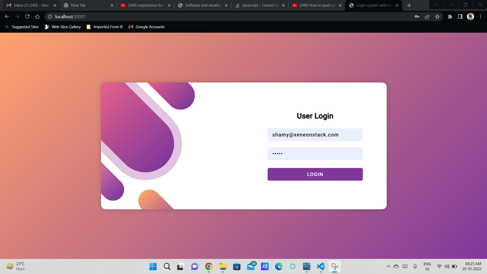
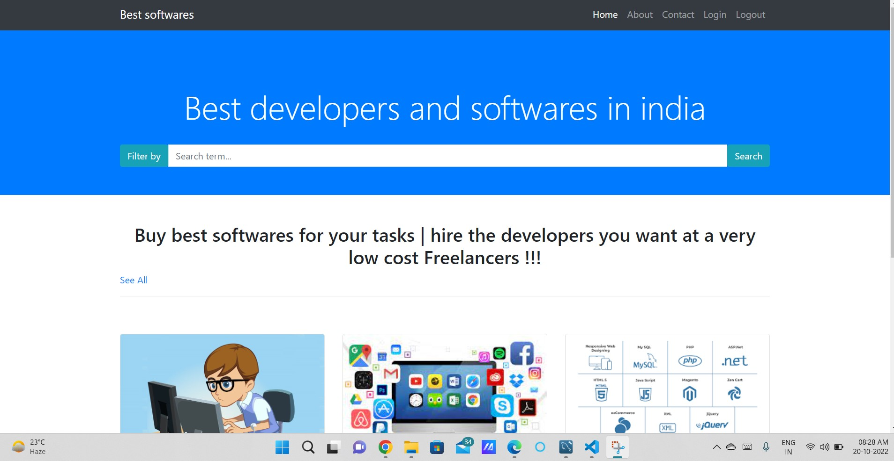
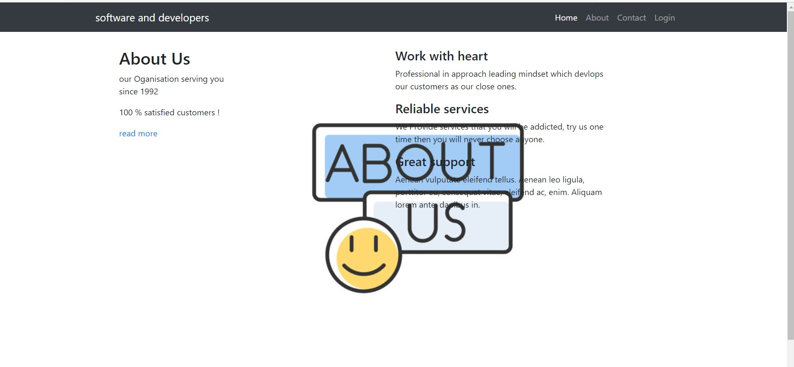
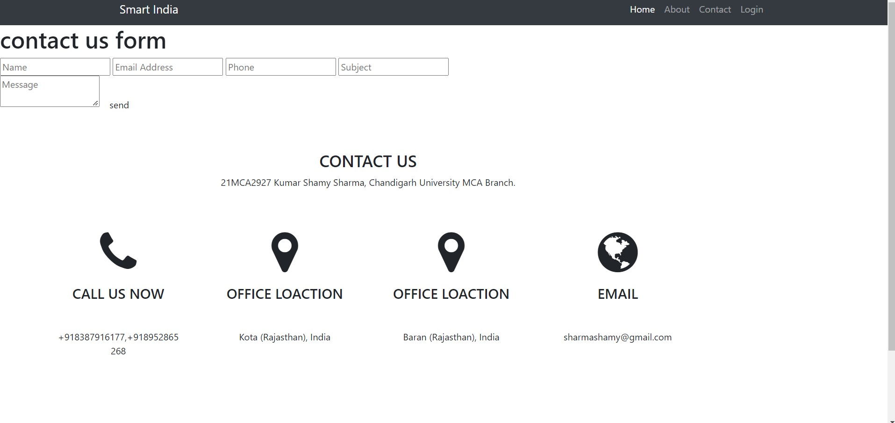
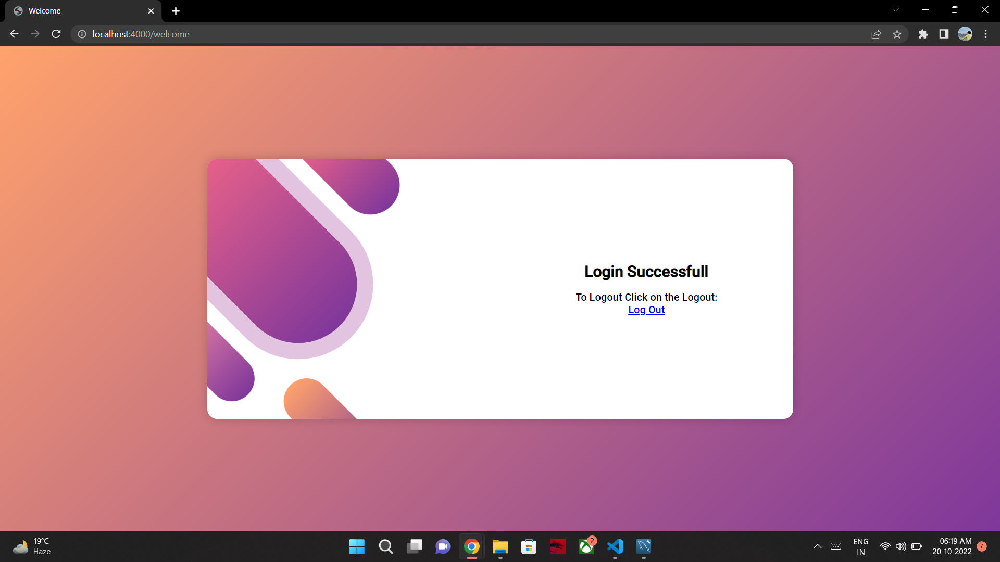
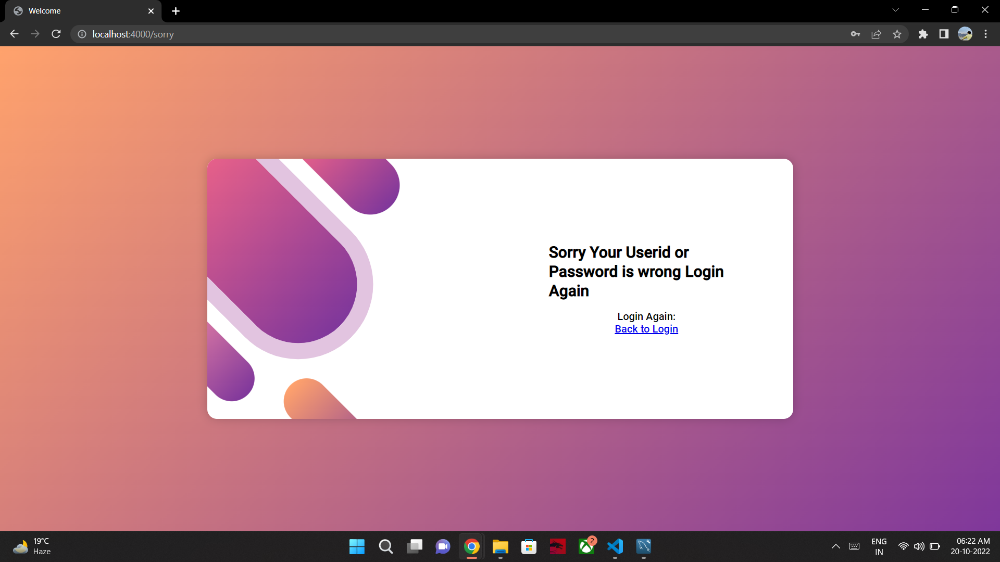

<a name="readme-top"></a>

[![LinkedIn][linkedin-shield]][linkedin-url]


<!-- PROJECT LOGO -->
<br />
<div align="center">
  <a href="">
    
  </a>

  <h3 align="center">Xenonstack Task (developers and softwares)</h3>

  <p align="center">
Fully responsive Webite with CRUD functionality and database connectivity of login and logout form !!    <br />
    <br />
<!-- TABLE OF CONTENTS -->
<details>
  <summary>Table of Contents</summary>
  <ol>
    <li>
      <a href="#about-the-project">About The Project</a>
      <ul>
        <li><a href="#built-with">Built With</a></li>
      </ul>
    </li>
    <li>
      <a href="#getting-started">Getting Started</a>
      <ul>
        <li><a href="#prerequisites">Prerequisites</a></li>
      </ul>
    </li>
    <li><a href="#usage">Usage</a></li>
    <li><a href="#roadmap">Roadmap</a></li>
    <li><a href="#contributing">Contributing</a></li>
    <li><a href="#license">License</a></li>
    <li><a href="#contact">Contact</a></li>
    <li><a href="#acknowledgments">Acknowledgments</a></li>
  </ol>
</details>


<!-- ABOUT THE PROJECT -->
## About The Project

developers and softwares 
<div align="center">
  <a href="">
    
  </a>

* Fully Responsive website bult with HTML, CSS, bootstrap, node js and mysql.

* Used BootStrap: Bootstrap is a free and open-source CSS framework directed at responsive, mobile-first front-end web development. It contains HTML, CSS and JavaScript-based design templates for typography, forms, buttons, navigation, and other interface components.

<p align="right">(<a href="#readme-top">back to top</a>)</p>


### Built With

Node JS: Node.js is an open-source, cross-platform, back-end JavaScript runtime environment that runs on a JavaScript Engine and executes JavaScript code outside a web browser, which was designed to build scalable network applications.

MySQL: MySQL Workbench is a visual database design tool that integrates SQL development, administration, database design, creation and maintenance into a single integrated development environment for the MySQL database system.


* [![Bootstrap][Bootstrap.com]][Bootstrap-url]


<p align="right">(<a href="#readme-top">back to top</a>)</p>

### Prerequisites

* npm
  ```sh
  npm install npm@latest -g
  ```

* mysql
  ```sh
  npm install mysql
  ```
* express
  ```sh
  npm install express
  ```
### About us Page

<div align="center">
  <a href="">
    
  </a>

<p align="right">(<a href="#readme-top">back to top</a>)</p>


<!-- USAGE EXAMPLES -->
## Contact Us Page

<div align="center">
  <a href="">
    
  </a>


<p align="right">(<a href="#readme-top">back to top</a>)</p>


## User Login

- Login Using - Id - shamy@xeneonstack.com, password - 12345

<div align="center">
  <a href="">
    
  </a>

- Login Succesfull

<div align="center">
  <a href="">
    
  </a>

- [ ] Login Error

<div align="center">
  <a href="">
    
  </a>

* For Going Back to the Login Page click Return to Login

<p align="right">(<a href="#readme-top">back to top</a>)</p>

<!-- CONTACT -->
## Contact

Your Name - [@https://twitter.com/CulSam](https://twitter.com/hamysharma)

Project Link: [https://github.com/shamysharma](https://github.com/Hamy-sharma)

<p align="right">(<a href="#readme-top">back to top</a>)</p>


<!-- ACKNOWLEDGMENTS -->
## Acknowledgments

Open Source Library helps alot, So adding some resources which helped me with this project.

* [Img Shields](https://shields.io)
* [GitHub Pages](https://pages.github.com)
* [Font Awesome](https://fontawesome.com)

<p align="right">(<a href="#readme-top">back to top</a>)</p>


[linkedin-shield]: https://img.shields.io/badge/-LinkedIn-black.svg?style=for-the-badge&logo=linkedin&colorB=555
[linkedin-url]: https://www.linkedin.com/in/kumar-shami-sharma-ba08067b/

[Bootstrap.com]: https://img.shields.io/badge/Bootstrap-563D7C?style=for-the-badge&logo=bootstrap&logoColor=white
[Bootstrap-url]: https://getbootstrap.com
